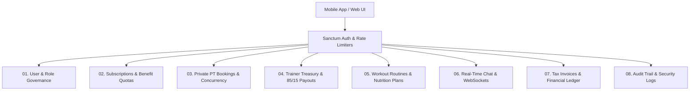

<p align="center">
  <a href="https://fitclub.laravel.cloud" target="_blank">
    
  </a>
</p>

<h1 align="center">🏋️‍♂️ FIT CLUB - Enterprise Gym & Fitness Coaching Platform</h1>

<p align="center">
  <strong>A modern, high-performance SaaS platform for gym memberships, private coach bookings, trainer wallets, custom diet/workout protocols, real-time WebSockets chat, and immutable audit logs.</strong>
</p>

<p align="center">
  
  
  
  
  
  
</p>

---

## 🌟 Executive Summary & Key Highlights

**FIT CLUB** is built with **Enterprise Clean Architecture** to handle high-concurrency fitness operations with zero financial discrepancies, race conditions, or unauthorized access.

- **🎨 Dark Neon Gym Aesthetic:** Modern, high-conversion UI built with Tailwind CSS, Alpine.js, and Remix Icons.
- **🛡️ Concurrency & Double-Submit Defense:** Dual-layer protection using **Pessimistic Database Locks** (`lockForUpdate`) and **Atomic Cache Locks** (`Cache::lock`) across subscriptions, PT session bookings, and trainer payouts.
- **📊 Immutable Security Audit Trail:** Powered by **Spatie Activity Log v5** across 11 core models with visual side-by-side **Old vs New value change diffs**.
- **⚡ Real-Time WebSockets Engine:** Instant coach-to-athlete 1-on-1 chat and notifications using **Laravel Reverb / Pusher**.
- **📱 100% Web-to-API Parity:** 55 fully documented RESTful API endpoints ready for **Flutter / React Native** mobile apps and headless **Next.js** frontends.
- **🧪 100% Automated Test Coverage:** 46 Pest/PHPUnit feature test suites verifying all critical financial, booking, and security workflows.

---

## 🏛️ System Architecture & Domain Modules



### 1. 🛡️ User & Role Governance (`Modules/User`)
- Strict Role-Based Access Control (**Spatie Permission**): `Admin`, `Trainer`, `Member`, and `Guest`.
- Immediate account suspension and session termination via `CheckUserBlocked` middleware.
- Profile management and media attachment library (**Spatie MediaLibrary**).

### 2. 💳 Subscriptions & Benefit Quotas Engine (`Modules/Subscription`)
- 7-Benefit real-time quota tracking: Personal Training sessions, InBody scans, Kickboxing classes, Guest invitations, Freeze days, and Nutrition plans.
- **7-Day Plan Upgrade Rule:** Members can upgrade to higher tiers within 7 days by paying only the price difference.
- Protected by Atomic Cache Locks to prevent duplicate billing during rapid double-clicks.

### 3. 📅 Private PT Bookings & Concurrency Shield (`Modules/Subscription`)
- Pessimistic locking prevents simultaneous slot overlapping for the same trainer.
- **24-Hour Refund Engine:**
  - Cancel > 24 hours prior to session: **100% quota refunded** to member balance.
  - Cancel < 24 hours prior to session: **0% refund** to safeguard the coach's schedule.

### 4. 💰 Trainer Treasury & Payouts (`Modules/Wallet`)
- Automatic commission split on session completion: **85% net credit to Trainer**, **15% gym commission**.
- Trainer payout requests via **InstaPay** or **Vodafone Cash** with balance freezing and admin approval workflow.
- Digital printable payout vouchers with unique reference codes.

### 5. 🏋️‍♂️ Custom Workout & Nutrition Generators (`Modules/Workout`)
- Coaches can build multi-day split routines with target muscles, exercise names, sets, reps, and rest intervals.
- Customized macro-calculated diet plans with daily calories, protein, carbs, fats, and scheduled meals.
- Coach athlete roster for easy trainee assignment.

### 6. 💬 Real-Time Chat & WebSockets (`Modules/Chat`)
- 1-on-1 real-time messaging between members and coaches with image attachments.
- Event broadcasting (`MessageSent`) via private channels with rate limiting (`throttle:chat`).

### 7. 🧾 Invoices & Financial Ledger (`Modules/Payment`)
- Auto-generated tax invoices with printable PDF downloads (**Barryvdh DomPDF**).
- Master administrative financial ledger with payment gateway webhook integration.

### 8. 📊 Audit Trail & Activity Logging (`Modules/User`)
- Complete tracking of changes on 11 sensitive models: `User`, `SubscriptionPlan`, `GymSchedule`, `GymRule`, `UserSubscription`, `Booking`, `PayoutRequest`, `WalletTransaction`, `Payment`, `WorkoutRoutine`, `DietPlan`.
- Interactive Alpine.js Diff Viewer showing before/after values.

---

## 🧪 Automated Testing Suite (46 / 46 Green Tests)

Run the full automated testing suite:

```bash
php artisan test
```

### ✅ Test Coverage Breakdown:
| Test Suite | Focus Area | Status |
| :--- | :--- | :--- |
| `AuthAndRolesTest` | Member role assignment, guest redirects, blocked user middleware lockout | **PASSED** ✅ |
| `SubscriptionPurchaseTest` | Plan activation, 7 benefit counters initialization, 7-day upgrade price difference | **PASSED** ✅ |
| `BookingCollisionTest` | Concurrency pessimistic locks preventing double bookings on identical slots | **PASSED** ✅ |
| `BookingCancellationRefundTest` | 100% quota restoration >24h vs non-refundable <24h policy | **PASSED** ✅ |
| `TrainerWalletAndPayoutTest` | 85/15 commission credit, payout balance freezing, admin approval settlement | **PASSED** ✅ |
| `GymRulesAndCacheTest` | Rule ordering, active status filtering, automated cache invalidation | **PASSED** ✅ |
| `ActivityLogTest` | User moderation, plan price changes audit trail, Admin UI & API access | **PASSED** ✅ |
| `RateLimitingTest` | Throttling login after 5 attempts, blocking 6th with HTTP 429 | **PASSED** ✅ |
| `WorkoutAndChatApiTest` | Workout/diet assignment via API, WebSocket chat initialization & messaging | **PASSED** ✅ |

---

## 📦 RESTful API & Postman Collection

The repository includes a production-ready Postman collection with **55 endpoints** and **Automatic Bearer Token Extraction**:

- 📂 **Postman Collection:** [`gym_platform_postman_collection.json`](./gym_platform_postman_collection.json)
- 📄 **API Documentation:** [`API_DOCUMENTATION.md`](./API_DOCUMENTATION.md)

### 🚀 How to import in Postman:
1. Open **Postman** and click **Import**.
2. Select `gym_platform_postman_collection.json`.
3. Set your `base_url` variable (e.g. `http://127.0.0.1:8000` or `https://fitclub.laravel.cloud`).
4. Execute `02. Authentication / Login` — the Bearer Token is automatically captured and injected into all subsequent requests!

---

## 🛠️ Local Installation & Setup

### 1. Prerequisites
- **PHP:** 8.2 or higher
- **Composer:** 2.x
- **Node.js:** 18.x or higher & NPM
- **Database:** MySQL 8.0+ or PostgreSQL
- **Cache / Queue:** Redis or Database

### 2. Clone and Install Dependencies
```bash
git clone https://github.com/YOUR_USERNAME/gym-platform.git
cd gym-platform

composer install
npm install
```

### 3. Environment Configuration
```bash
cp .env.example .env
php artisan key:generate
```

Configure your database and queue credentials in `.env`:
```env
DB_CONNECTION=mysql
DB_HOST=127.0.0.1
DB_PORT=3306
DB_DATABASE=gym_platform
DB_USERNAME=root
DB_PASSWORD=

CACHE_STORE=database
QUEUE_CONNECTION=database
```

### 4. Run Migrations & Seeders
```bash
php artisan migrate --seed
php artisan storage:link
```

### 5. Compile Assets & Run Development Servers
```bash
# Terminal 1 (Frontend Vite Build)
npm run dev

# Terminal 2 (Backend Server)
php artisan serve
```

Default Admin Credentials:
- **Email:** `mina@gym.com`
- **Password:** `password123`

---

## ☁️ Deployment on Laravel Cloud

1. Push this repository to your **GitHub** account.
2. Log in to your **[Laravel Cloud](https://cloud.laravel.com)** console.
3. Click **New Application** and select this repository (`gym-platform`).
4. Configure production environment variables (`APP_KEY`, `DB_*`, `SANCTUM_STATEFUL_DOMAINS`).
5. Set the Pre-deployment command:
   ```bash
   php artisan migrate --force
   php artisan test
   ```
6. Click **Deploy Now**! 🚀

---

## 📄 License
This project is open-sourced software licensed under the **MIT License**.

---
*Built with ❤️ & Enterprise Clean Architecture for FIT CLUB.*
